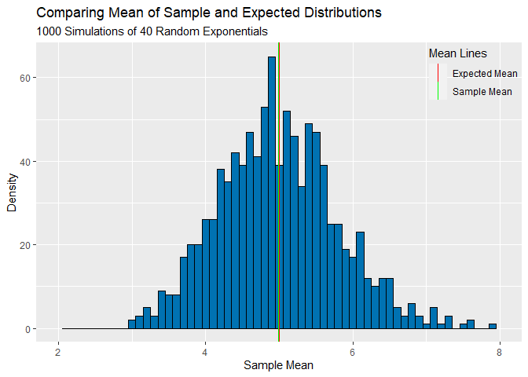
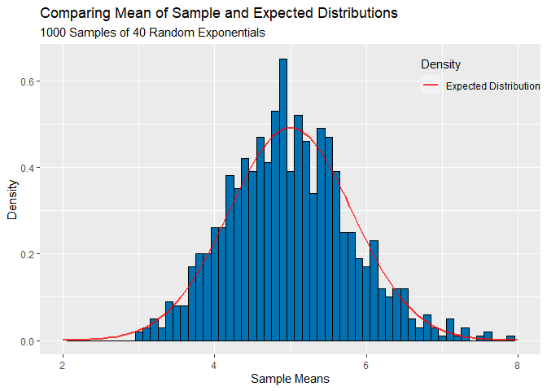
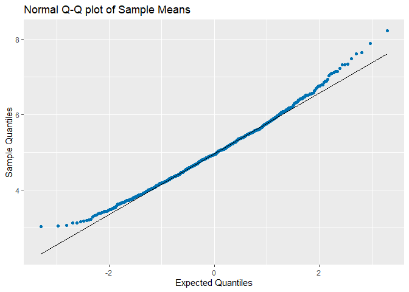
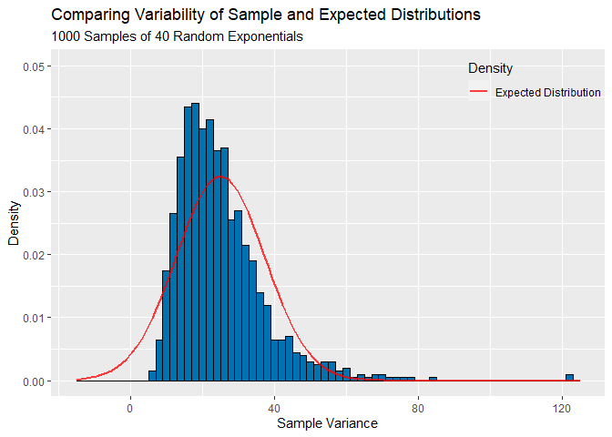
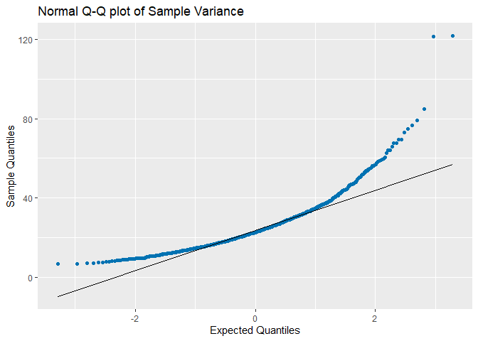

Comparing Exponential Distribution with the Central Limit Theorem
================
Wesley Devlin
3/13/2022

In this project you will investigate the exponential distribution in R
and compare it with the Central Limit Theorem. The exponential
distribution can be simulated in R with rexp(n, lambda) where lambda is
the rate parameter. The mean of exponential distribution is 1/lambda and
the standard deviation is also 1/lambda. Set lambda = 0.2 for all of the
simulations. You will investigate the distribution of averages of 40
exponentials. Note that you will need to do a thousand simulations.

Overview:

In this data set, 1000 random exponentials are compared against 1000
averages of 40 exponentials. Plots are generated and show how the
comparison of these samples follow a normal distribution.

The code generated below loads in the required packages and sets up the
comparison. 40 observations and 1000 randoms are generated with lambda
set at 0.2.

``` r
library(ggplot2)
library(statsr)
library(dplyr)
library(matrixStats)
set.seed(1000)
lambda<-0.2
#expected mean
n<-40 # number of observations
nsim<-1000 # number of simulations
mu <-1/lambda # expected mean 
var <- 1/(lambda^2) # theo var
sigma <- sqrt(var) # expected std dev

nsimdata <- matrix(rexp(n= nsim*n,rate=lambda), nsim, n)
sample_means <- rowMeans(nsimdata)
sample_vars <- rowVars(nsimdata)

sampleVar <- var(sample_means)
sampleSD <- sd(sample_means)

simmeans_df <- data.frame(sample_means)
simvars_df <- data.frame(sample_vars)
names(simmeans_df) <- c("nsimmean")
names(simvars_df) <- c("nsimvars")
summary(simmeans_df)
```

    ##     nsimmean    
    ##  Min.   :3.024  
    ##  1st Qu.:4.415  
    ##  Median :4.944  
    ##  Mean   :4.987  
    ##  3rd Qu.:5.499  
    ##  Max.   :8.212

``` r
summary(simvars_df)
```

    ##     nsimvars      
    ##  Min.   :  6.586  
    ##  1st Qu.: 16.795  
    ##  Median : 22.612  
    ##  Mean   : 25.093  
    ##  3rd Qu.: 30.453  
    ##  Max.   :121.677

The plot compares the sample mean to the expected mean. The lines on the
plot are meant to show just how close the relational mean truly is.

``` r
ggplot(simmeans_df, aes(X = nsimmean, fill = c('red','green'), color = c('red', 'green'))) +
        geom_histogram(aes(x=nsimmean),color = 'black', fill = '#0072B2', size = .5, binwidth = .1) +
        geom_vline(aes(xintercept = mean(sample_means), color = 'Sample Mean'), size = .5) +
        geom_vline(aes(xintercept = mu, color = 'Expected Mean'), size = .5) +
        scale_color_manual("Mean Lines", values=c("red","green"))+
        scale_x_continuous(limits = c(2, 8))+
        labs(title = 'Comparing Mean of Sample and Expected Distributions', x = 'Sample Mean',
             y = 'Density', subtitle = '1000 Simulations of 40 Random Exponentials')+
       theme(legend.position = c(0.90,0.90), legend.background = element_rect(fill = 'transparent', colour = NA))
```

<!-- -->

A second plot is generated is a normal distribution line overlayed on
top of the density plot further explaining the normality of the
distribution.

``` r
ggplot(simmeans_df, aes(x = nsimmean)) + 
        geom_histogram(aes(y=..density..), color = 'black', fill = '#0072B2', size = .5, binwidth = .1)+
        geom_function(aes(color ='Expected Distribution'),fun = dnorm, args = list(mean=mu, sd = sampleSD), size = 1, alpha = 0.75)+
        scale_color_manual('Density', values = c('red','black'))+
        scale_x_continuous(limits = c(2, 8))+
        labs(title = 'Comparing Mean of Sample and Expected Distributions', x = 'Sample Means',
             y = 'Density', subtitle = '1000 Samples of 40 Random Exponentials' )+
       theme(legend.position = c(0.88,0.90), legend.background = element_rect(fill = 'transparent', colour = NA))
```

<!-- -->

A generated QQ plot which shows how the data follows the same normal
distribution.

``` r
ggplot(simmeans_df, aes(sample = nsimmean)) +
  stat_qq(color = '#0072B2') +
  stat_qq_line()+
        labs(title = 'Normal Q-Q plot of Sample Means', x = 'Expected Quantiles',
             y = 'Sample Quantiles')
```

<!-- -->

Next, we are compairing the sample variance to the expected variance.
This plot shows the variability of the mean of 40 exponentials and
compares it to the expected variance. The red line drawn shows how a
normal distribution of the variance at a mean of 25 closely resembles
the sample variance.

``` r
ggplot(simvars_df, aes(x = nsimvars)) + 
        geom_histogram(aes(y=..density..), color = 'black', fill = '#0072B2', size = 0.5, binwidth =2)+
        geom_function(aes(color = 'Expected Distribution'),fun = dnorm, args = list(mean=var, sd = sd(sample_vars)), size = 1, alpha = 0.75)+
        scale_y_continuous(limits = c(0,.05))+
        scale_x_continuous(limits = c(-15, 125))+
        scale_color_manual('Density', values = c('red'))+
        labs(title = 'Comparing Variability of Sample and Expected Distributions', x = 'Sample Variance',
             y = 'Density', subtitle = '1000 Samples of 40 Random Exponentials')+
       theme(legend.position = c(0.873,0.91), legend.background = element_rect(fill = 'transparent', colour = NA))
```

<!-- -->

A second Q-Q plot showing comparing the normality of the variance in the
data.

``` r
ggplot(simvars_df, aes(sample = nsimvars)) +
  stat_qq(color = '#0072B2') +
  stat_qq_line()+
        labs(title = 'Normal Q-Q plot of Sample Variance', x = 'Expected Quantiles',
             y = 'Sample Quantiles')
```

<!-- -->
